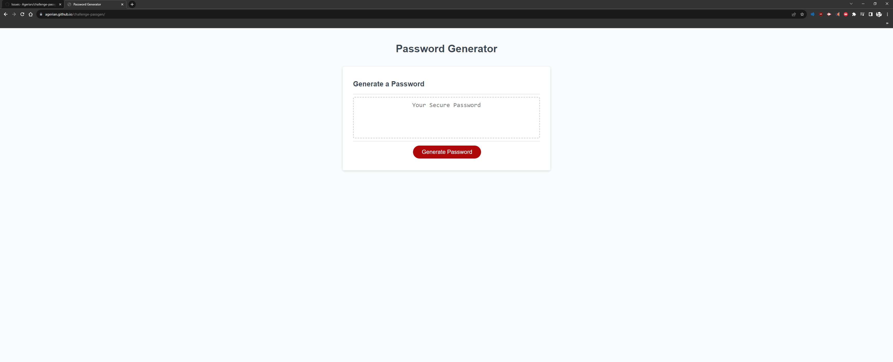

# Password Generator

This application allows individuals to generate random passwords based on selected criteria. It runs in the browser and allows users to customize their password by selecting lowercase, uppercase, numbers, and special characters.

## User Story

As an employee with access to sensitive data I want to randomly generate a password that meets certain criteria so that I can create a strong password that provides greater security.

## Acceptance Criteria

-Click the button to generate a password.
-Select which criteria to include in the password.
-Choose a length of 8 characters or more to a max of 20 characters.
-Generate a password that matches selected criteria.
-Display the generated password on the page.

## Mock-Up

The following image shows the web app's appearance:

## How to Use

1. Open the password generator in your web browser.
2. Click the "Generate Password" button to start the process.
3. Select your preferences from the on-screen prompts.
4. After selecting prompts, a password will be generated.
5. The password is displayed in the text area.

## Deployment

- [Live Application] [https://agerian.github.io/challenge-passgen/]

- [GitHub Repo] [https://github.com/Agerian/challenge-passgen]
